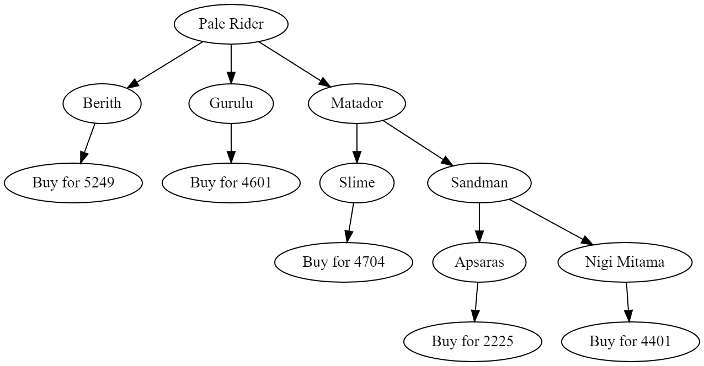

# Persona 3 Fusion Calculator
Library for calculating the cheapest way to make a specific persona based on the personas you have unlocked for buying. I will probably make some UI for this in the future.

## Example output

## How to use
Right now, you need to compile it from scratch using [rust](https://www.rust-lang.org/tools/install). See examples/recipe_tree_dot.rs for how to use the library to produce the output from above.